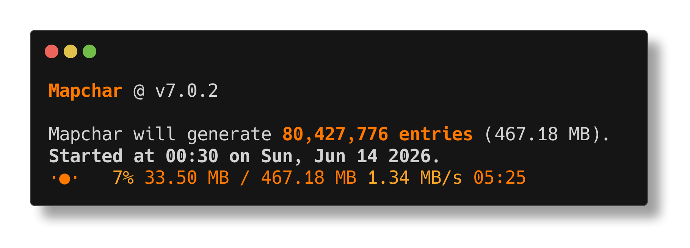

<p align="center">
  <br>
  <a href="https://github.com/pwnfo/mapchar" target="_blank"></a>
  <br>
  <span>Generate wordlists using pattern logic and expressions</span>
  <br>
</p>

<p align="center">
  <a href="#installation">Installation</a>
  &nbsp;&nbsp;&nbsp;•&nbsp;&nbsp;&nbsp;
  <a href="#documentation">Documentation</a>
  &nbsp;&nbsp;&nbsp;•&nbsp;&nbsp;&nbsp;
  <a href="#usage">Usage</a>
  &nbsp;&nbsp;&nbsp;•&nbsp;&nbsp;&nbsp;
  <a href="#contributing">Contributing</a>
</p>

> [!NOTE]
> **This project was renamed from `fuse` / `fuse-generator` to `mapchar`** starting from version 7.0.2.
> The PyPI package, CLI command, and Python package name have all changed accordingly.
> If you were using the old name, please update your installs and imports.

<p align="center">

</p>

## Installation

> [!NOTE]
> It is **recommended** to install using `pipx` or `pip` for the PyPI version.

| Method | Notes |
| - | - |
| `pipx install mapchar` | `pip` may be used in place of `pipx` |
| `git clone https://github.com/pwnfo/mapchar.git && cd mapchar && pip install .` | Clone and install directly from GitHub |

## Documentation

For a complete guide, feature explanations, and advanced examples, please visit [the documentation](https://mapchar.readthedocs.io/).

<p align="center">
  <a href="https://mapchar.readthedocs.io/" target="_blank">
    
  </a>
</p>

## General usage


To generate a wordlist from a simple expression:
```bash
mapchar '/l{2,4}'
```

To combine files with generators:
```bash
mapchar '^:^' names.txt pass.txt
```

Outputs can be manipulated, filtered, and saved.

```console
General Options:
  -h, --help            show this help message and exit
  -v, --version         show version information and exit
  -S, --stats           show pattern statistics and exit
  -q, --quiet           suppress non-essential output
  -n, --non-interactive
                        skip the confirmation prompt before execution

Generation Options:
  -d, --delimiter <string>
                        string inserted between generated entries
  -b, --write-buffer <size>
                        output buffer size
  -w, --workers <1-64>  number of worker processes (default: 1)
  -k, --flush-threshold <size>
                        flush output after reaching this byte threshold (default: 512KB)

Input Options:
  -f, --file <path>     load patterns from file
  -s, --start <word>    start writing output from <word>
  -e, --end <word>      stop writing output at <word>

Output Options:
  -o, --output <path>   write output to a file
  -z, --compress <format>
                        compress output (supported: gzip, bzip2, lzma)
  -l, --compresslevel <level>
                        compression level for the selected format
```

### Expression basics

* Literal characters produce themselves.
* Built-in classes and bracketed classes `[...]` produce one item per position.
* Concatenation combines positions: each position picks one value from its token and concatenates.

Example:
```bash
$ mapchar '/l{2,3}'
# output: aa, ab, ac, ..., ZY, ZZ
```

### Character classes

| Symbol | Meaning                          |
| ------ | -------------------------------- |
| `/l`   | letters (a–z, A–Z)               |
| `/a`   | lowercase letters (a–z)          |
| `/A`   | uppercase letters (A–Z)          |
| `/d`   | digits (0–9)                     |
| `/D`   | non-zero digits (1–9)            |
| `/h`   | lowercase hexadecimal (0–9, a–f) |
| `/H`   | uppercase hexadecimal (0–9, A–F) |
| `/s`   | space                            |
| `/o`   | octal digits (0–7)               |
| `/p`   | special characters               |
| `/b`   | newline (`\n`)                   |

Example: `/l/l` generates all two-letter combinations (upper and lower case).

### Custom classes and unions

* `[abc]` selects **one character** from `a`, `b`, or `c`.
* Use `|` to separate full-word alternatives inside classes:
  * `[admin|root|123]` inserts `admin` OR `root` OR `123` at that point.
* Use `||` to separate **top-level expressions**:
  * `mapchar 'admin/d||guest/d'` chains two independent patterns.

### Statistics

You can analyze a pattern before generating it using the `-S/--stats` flag. This shows token counts, estimated size, and range filtering details.

```bash
mapchar -S '/l{3}||/d{3}'
```

### Quantifiers

* `{N}` — repeat exactly N times
* `{min,max}` — repeat between min and max times (inclusive)
* `?` — optional (0 or 1 time)

Examples:
```bash
$ mapchar '[XYZ]{3}'         # XXX, XXY, ..., ZZZ
$ mapchar '[XYZ]{2,5}'       # XY, XZ, ..., XYZXY
$ mapchar 'Ryan?/d'          # Rya0, Rya1, ..., Ryan9
$ mapchar '[XYZ]?Ryan'       # Ryan, XRyan, YRyan, ZRyan
```

### Numeric ranges

* `#[1-10]` → generates 1,2,3,4,5,6,7,8,9,10
* `#[1-10:2]` → generates 1,3,5,7,9
* `#[2-10:2]` → generates 2,4,6,8,10

These numeric ranges can be used in any position of an expression.

### Files and placeholders

Use `^` in an expression as a placeholder for the next file argument. Each `^` consumes one file and iterates over its lines:
```bash
$ mapchar '^/d' names.txt
# output: Bob0, Bob1, ..., Ana0, Ana1, ...

$ mapchar '^-^' names.txt years.txt
# output: Bob-1990, Ana-1991, Ryan-1992, ...
```

Prefix a filename with `//` to treat it as an inline expression instead of a file path.

### Value bindings

Use `<@name=expr>` to evaluate an expression **once per output line** and store it, then reuse it with `<@name>`.
Unlike concatenation, this introduces a dependency, so no cartesian product is created between the definition and its references.

```bash
$ mapchar '<@d=/d>-<@d>'
# output: 0-0, 1-1, ..., 9-9

$ mapchar '<@x=^>:<@x>' words.txt
# output: foo:foo, bar:bar, ...

$ mapchar '<@n=/d{2}>_<@n>'
# output: 00_00, 01_01, ..., 99_99
```

### Compression

Mapchar supports on-the-fly compression when writing output files.

```bash
# gzip (fast, balanced)
mapchar '/l{5}' -z gzip -o wordlist.txt.gz

# lzma (best compression)
mapchar '/l{5}' -z lzma -o wordlist.txt.xz

# bzip2 (middle ground)
mapchar '/l{5}' -z bzip2 -o wordlist.txt.bz2
```

### Escaping special characters

Use `\` to escape special characters.
```bash
$ mapchar '\/d/d'
# output: /d/0, /d/1, ..., /d/9
```

## Contributing

We welcome contributions to Mapchar! Whether it's adding new features, improving documentation, or fixing bugs, your help is appreciated. 
Feel free to open an issue or submit a pull request on our GitHub repository at `pwnfo/mapchar`.

## Star History

<picture>
  <source media="(prefers-color-scheme: dark)" srcset="https://api.star-history.com/svg?repos=pwnfo/mapchar&type=Date&theme=dark" />
  <source media="(prefers-color-scheme: light)" srcset="https://api.star-history.com/svg?repos=pwnfo/mapchar&type=Date" />
  
</picture>

## License

MIT © Ryan R. &lt;pwnfo@proton.me&gt;
